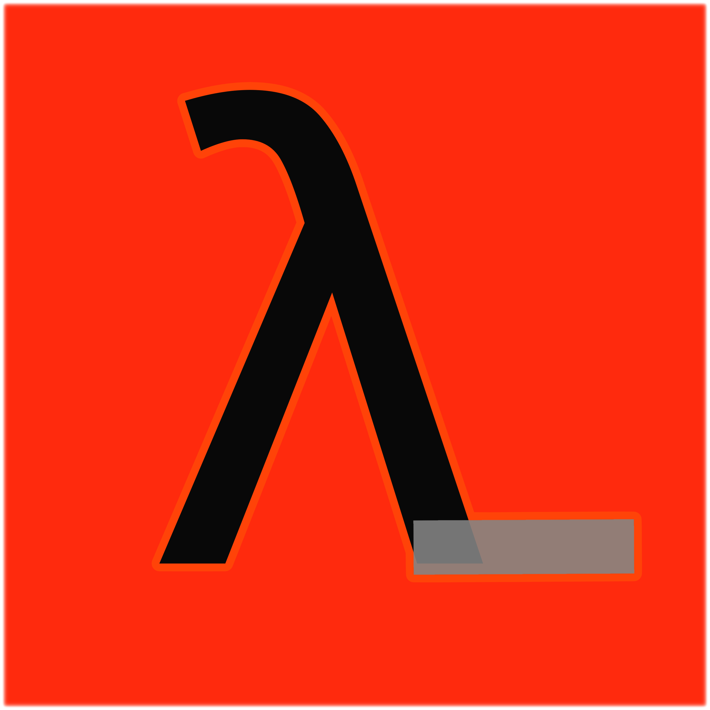

# LMAgent

<p align="center">
  
</p>

[](https://www.youtube.com/shorts/-_jKwfssAvA)

A cross-platform, locally-hosted AI agent that connects to any OpenAI-compatible LLM (LM Studio, Ollama, etc.) and can autonomously read and write files, run shell commands, manage git, track todos, coordinate sub-tasks, and much more — all from an interactive terminal REPL or a polished web UI.

---

## Table of Contents

- [Security & Sandboxing](#security--sandboxing)
- [Files](#files)
- [First Setup](#first-setup)
- [Usage Modes](#usage-modes)
- [Configuration](#configuration)
- [Available Tools](#available-tools)
- [REPL Slash Commands](#repl-slash-commands)
- [Personality (Soul)](#personality-soul)
- [Project Config](#project-config)
- [MCP Servers](#mcp-servers)
- [Scheduled Waits](#scheduled-waits)
- [Session Storage](#session-storage)
- [Web UI Features](#web-ui-features)
- [Limitations](#limitations)
- [Tips & Troubleshooting](#tips--troubleshooting)
- [Version History](#version-history)

---

## Security & Sandboxing

LMAgent runs all shell and git commands inside a hardened Docker container. The LLM is physically isolated from your host machine — it cannot access your files, system settings, or directories outside the designated workspace folder.

### How It Works

A single persistent Docker container is created on first use and reused across sessions. The container is locked down with the following protections:

- **Read-only filesystem** — the container's own system files cannot be modified
- **Workspace-only write access** — the only folder the LLM can read or write is your designated workspace, mounted at `/workspace` inside the container
- **All Linux capabilities dropped** — no privileged operations
- **No privilege escalation** — `no-new-privileges` enforced
- **PID limit** — fork bombs are capped at 128 processes
- **Memory cap** — 512 MB by default (configurable up to 2 GB)
- **CPU cap** — 90% of one core maximum
- **Git sandboxed** — git commands run inside the Docker container, not on your host. This prevents malicious git hooks or submodule URLs from touching your host machine.

### Shell Command Safety

Beyond the Docker boundary, every shell command is also validated by the safety layer before it reaches the sandbox:

- **Directory navigation blocked** — `cd`, `Set-Location`, `pushd`, and equivalents are rejected. The shell always executes from the workspace root.
- **Absolute paths enforced** — commands referencing paths outside the workspace are blocked by default (`SHELL_WORKSPACE_ONLY=true`).
- **Environment-variable paths blocked** — references to `$HOME`, `~`, `%APPDATA%`, etc. are rejected.
- **Path traversal blocked** — `../` and `..\` sequences are rejected.
- **Destructive commands outside workspace are always blocked** — even with `SHELL_WORKSPACE_ONLY=false`.

### The Workspace Folder

Your workspace folder on Windows (or macOS/Linux) is mounted directly into the container. This is a live two-way link — files you drop into the folder instantly appear inside the container, and files the LLM creates instantly appear in your folder.

The LLM can only see and touch that one folder on your real machine. Everything else on your PC is completely invisible to it.

### Docker Network

By default the container runs with `bridge` network mode, meaning it can make outbound internet connections (required for pip installs, web requests, etc.). If you want full air-gap isolation and don't need internet access inside the container, set `DOCKER_NETWORK = "none"` in `sandboxed_shell.py`. This blocks all external network access from inside the container.

### Fallback Mode

If Docker is not running, LMAgent falls back to a process-group sandbox with memory and CPU limits. A loud warning is printed to the terminal when this happens. Start Docker Desktop to restore full isolation.

> **Note:** The POSIX fallback (macOS/Linux without Docker) uses `RLIMIT_AS` and process groups for resource limiting, but does **not** provide filesystem isolation. The agent can only reach outside the workspace through the shell tool if Docker is not active. Start Docker Desktop or set `FORCE_DOCKER = True` in `sandboxed_shell.py` for full isolation on POSIX systems.

### Requirements

```bash
pip install psutil docker
```

Docker Desktop must be running on Windows. On macOS/Linux, Docker is optional — the process-group backend is used by default unless you set `FORCE_DOCKER = True` in `sandboxed_shell.py`.

---

## Files

| File | Version | Role |
|---|---|---|
| `agent_core.py` | v9.3.5-sec | Foundation layer — config, logging, sessions, state, todos, plans, shell sessions, MCP client, message compaction |
| `agent_tools.py` | v9.5.2-vision | Tool handlers, tool schemas, tool registry, vision support |
| `agent_llm.py` | — | LLM HTTP client, streaming parser, agent execution loop, system prompts, sub-agent runner |
| `agent_main.py` | — | CLI entrypoint, `run_agent()`, interactive REPL, background scheduler |
| `agent_web.py` | v6.9.1 | Flask web UI — place next to the other files |
| `sandboxed_shell.py` | — | Cross-platform sandboxed subprocess execution (Docker + fallback) |

All six files must be in the same directory.

---

## First Setup

### 1. Install Python Dependencies

LMAgent requires Python 3.10 or later.

```bash
pip install requests flask colorama psutil docker
```

### 2. Install and Start Docker Desktop

Download and install [Docker Desktop](https://www.docker.com/products/docker-desktop/). Make sure it is running before you launch LMAgent. The sandbox container is created automatically on first use.

On first use the container startup command installs git automatically:

```
apt-get install -y -q git && while true; do sleep 3600; done
```

This means **git is available in the sandbox** without needing a custom Docker image.

### 3. Set Up Your LLM

LMAgent connects to any OpenAI-compatible API endpoint. The easiest option is [LM Studio](https://lmstudio.ai/):

1. Download and install LM Studio
2. Download a model (recommended: a 7B+ instruct or coder model)
3. Go to **Local Server** in LM Studio and click **Start Server**
4. The server runs at `http://localhost:1234` by default — this is what LMAgent expects out of the box

You can also use Ollama, a remote OpenAI-compatible API, or any other compatible server — just update `LLM_URL` in your config.

### 4. Create a Workspace

Your workspace is the directory LMAgent works inside. It reads and writes files here, and stores all session data in a hidden `.lmagent/` subfolder.

```bash
mkdir ~/lmagent_workspace
```

You can use any existing project directory as your workspace too. On Windows, create a regular folder anywhere — drop files into it and the LLM will be able to see and work with them instantly.

### 5. Create a `.env` File

Create a file called `.env` in the same directory as the agent scripts:

```env
WORKSPACE="/home/you/lmagent_workspace"
LLM_URL="http://localhost:1234/v1/chat/completions"
LLM_API_KEY="lm-studio"
LLM_MODEL=""
PERMISSION_MODE="normal"
```

| Variable | Description |
|---|---|
| `WORKSPACE` | Absolute path to the directory the agent reads/writes files in |
| `LLM_URL` | Your LLM server endpoint. Leave as-is for LM Studio defaults |
| `LLM_API_KEY` | Can be anything for local servers; only matters for remote APIs |
| `LLM_MODEL` | Model name to request. Leave blank to use whatever is loaded in LM Studio |
| `PERMISSION_MODE` | `normal` (asks before destructive actions), `auto` (no prompts), or `manual` (asks before everything) |

If you skip this step entirely, LMAgent will prompt you to enter a workspace path on first launch and offer to save it to `.env` automatically.

### 6. Run It

**Terminal REPL:**
```bash
python agent_main.py
```

**Web UI:**
```bash
python agent_web.py
```
Then open `http://localhost:7860` in your browser (the exact URL and PIN are printed to the console on startup).

You should see the LMAgent banner and a confirmation that the LLM connected. Type a task and press Enter.

---

## Usage Modes

### Interactive REPL

```bash
python agent_main.py
```

Starts a conversational loop with a background scheduler running alongside it. Type your task and press Enter. The scheduler automatically wakes any sessions that were scheduled to resume at a future time.

### One-Shot Task

```bash
python agent_main.py "Summarise all Python files in this workspace"
```

Runs a single task and exits with a meaningful exit code:

| Code | Meaning |
|---|---|
| `0` | Completed or cancelled |
| `2` | Max iterations hit |
| `130` | Interrupted (Ctrl+C) |
| `1` | Error |

### Web UI

```bash
python agent_web.py
```

Opens at `http://0.0.0.0:7860` by default. A PIN is printed to the console on startup — use it to log in. Set `AGENT_TOKEN` in the environment for a fixed token instead of a random one each run. Also accessible from your phone on the local network — the startup output shows your LAN address.

```env
AGENT_TOKEN=mysecretpin
AGENT_PORT=7860
AGENT_HOST=127.0.0.1
AGENT_CERT=/path/to/cert.pem   # optional TLS
AGENT_KEY=/path/to/key.pem
```

### Resume a Previous Session

```bash
python agent_main.py --list-sessions
python agent_main.py --resume SESSION_ID
```

### Plan Before Acting

```bash
python agent_main.py --plan "refactor the authentication module"
```

The agent produces a step-by-step plan for your approval before it does anything.

### Scheduler Daemon Only

```bash
python agent_main.py --scheduler
```

Runs only the background scheduler — useful when you're driving LMAgent entirely from the web UI.

### Submit a Task to a Running Scheduler

```bash
python agent_main.py --submit "generate the weekly report"
```

Drops the task into the inbox. A running scheduler picks it up automatically within its next poll interval.

---

## Configuration

Set any of these in your `.env` file or as environment variables.

### Core Settings

| Variable | Default | Description |
|---|---|---|
| `WORKSPACE` | `~/lm_workspace` | Directory the agent reads/writes files in |
| `LLM_URL` | `http://localhost:1234/v1/chat/completions` | LLM API endpoint |
| `LLM_API_KEY` | `lm-studio` | API key (anything works for local servers) |
| `LLM_MODEL` | *(blank)* | Model name to request; blank = server default |
| `PERMISSION_MODE` | `normal` | `auto` / `normal` / `manual` |

### LLM Settings

| Variable | Default | Description |
|---|---|---|
| `LLM_MAX_TOKENS` | `-1` | Max tokens per response (-1 = server default) |
| `LLM_TEMPERATURE` | `0.65` | Sampling temperature |
| `LLM_TIMEOUT` | `560` | Seconds to wait for an LLM response |
| `LLM_MAX_RETRIES` | `3` | Retry attempts on connection failure |
| `LLM_RETRY_DELAY` | `3.0` | Seconds between retries |
| `THINKING_MODEL` | `true` | Strip `<think>` blocks from context (for QwQ, DeepSeek-R1, etc.) |
| `THINKING_MAX_TOKENS` | `16000` | Token budget for thinking models |

### Context & Memory

| Variable | Default | Description |
|---|---|---|
| `SUMMARIZATION_THRESHOLD` | `80000` | Token count at which context gets compacted |
| `KEEP_RECENT_MESSAGES` | `30` | Maximum messages kept after compaction |
| `ENABLE_SUMMARIZATION` | `true` | Enable automatic context compaction |

### Agent Behaviour

| Variable | Default | Description |
|---|---|---|
| `MAX_ITERATIONS` | `500` | Hard cap on iterations per task |
| `MAX_SUB_AGENT_ITERATIONS` | `25` | Max iterations for sub-agents |
| `MAX_SAME_TOOL_STREAK` | `8` | Max identical tool calls before loop detection triggers |
| `MAX_NO_PROGRESS_ITERS` | `15` | Max iterations without progress before aborting |
| `MAX_ERRORS` | `5` | Max consecutive errors before aborting |
| `MAX_EMPTY_ITERATIONS` | `5` | Max iterations with no output before aborting |
| `ENABLE_SUB_AGENTS` | `true` | Allow the agent to spawn sub-agents for file creation |
| `ENABLE_TODO_TRACKING` | `true` | Track todos across iterations |
| `ENABLE_PLAN_ENFORCEMENT` | `true` | Enforce step-by-step plans |

### Vision Settings

| Variable | Default | Description |
|---|---|---|
| `VISION_ENABLED` | `auto` | `auto` probes LM Studio on first use; `true` skips the probe and always enables; `false` always disables |
| `LLM_BASE_URL` | `http://localhost:1234` | Base URL used for the vision capability probe (hits `/api/v1/models`) |

### Security Settings

| Variable | Default | Description |
|---|---|---|
| `REQUIRE_WORKSPACE` | `true` | Enforce workspace path restriction for file tools |
| `SHELL_WORKSPACE_ONLY` | `true` | Block shell commands referencing paths outside workspace |
| `BLOCKED_COMMANDS` | *(platform list)* | Comma-separated list of blocked command strings |

### Scheduler & Output Limits

| Variable | Default | Description |
|---|---|---|
| `SCHEDULER_POLL_INTERVAL` | `60` | Seconds between scheduler wake-up checks |
| `MAX_TOOL_OUTPUT` | `500000` | Max characters in a tool result |
| `MAX_FILE_READ` | `1000000` | Max characters when reading a file |
| `MAX_GREP_RESULTS` | `50` | Max grep matches returned |
| `MAX_LS_ENTRIES` | `100` | Max directory entries listed |

---

## Available Tools

LMAgent calls these tools autonomously during a task.

### Files

| Tool | Description |
|---|---|
| `read` | Read a file (workspace only) |
| `write` | Create or overwrite a file |
| `edit` | Fuzzy search-and-replace within a file |
| `glob` | Find files matching a glob pattern |
| `grep` | Search text across files |
| `ls` | List a directory |
| `mkdir` | Create a directory |

### Shell

| Tool | Description |
|---|---|
| `shell` | Run a command inside the Docker sandbox. Timeout 1–120s, memory 64MB–2GB. Falls back to process-group isolation if Docker is unavailable. |

### Git

All git operations run inside the Docker sandbox, not on your host machine.

| Tool | Description |
|---|---|
| `git_status` | Show working tree status |
| `git_diff` | Show uncommitted changes |
| `git_add` | Stage files for commit |
| `git_commit` | Commit staged changes |
| `git_branch` | List, create, or switch branches |

### Task Management

| Tool | Description |
|---|---|
| `todo_add` | Add a todo item |
| `todo_complete` | Mark a todo as done |
| `todo_update` | Update todo status |
| `todo_list` | List all todos |
| `plan_complete_step` | Mark a plan step complete after verification |
| `task_state_update` | Checkpoint task progress (useful for large batch jobs) |
| `task_state_get` | Retrieve the current checkpoint |
| `task_reconcile` | Reconcile state after rename/move operations |

### Sub-Agents

| Tool | Description |
|---|---|
| `task` | Delegate single-file creation to an isolated sub-agent (file tools only — no shell or git access) |

### Vision

| Tool | Description |
|---|---|
| `vision` | Analyse a workspace image file using the loaded vision model. Only appears when a vision-capable model is detected. Accepts JPEG, PNG, GIF, and WebP. |

The vision tool probes LM Studio's `GET /api/v1/models` endpoint on first use to check whether the loaded model has vision capability. If you're using a non-LM Studio backend, set `VISION_ENABLED=true` to skip the probe and always enable the tool.

### Utilities

| Tool | Description |
|---|---|
| `get_time` | Current date and time |

---

## REPL Slash Commands

| Command | Description |
|---|---|
| `/help` | Show all commands |
| `/sessions` | List recent sessions |
| `/mode <level>` | Change permission mode (`auto` / `normal` / `manual`) |
| `/plan` | Show the current execution plan |
| `/todo` | Show the current todo list |
| `/status` | Show agent, LLM, shell sandbox, and MCP status |
| `/soul` | Show the loaded personality config |
| `/new` | Start a completely fresh session |
| `/session` | Show the current session ID |
| `quit` | Exit |

**Keyboard shortcuts:**

| Shortcut | Action |
|---|---|
| `↑` / `↓` | Cycle input history |
| `Ctrl+L` | New session |
| `Enter` | Send message |
| `Shift+Enter` | New line |

---

## Personality (Soul)

Create a `.soul.md` file in your workspace to give LMAgent a custom personality or standing instructions that apply to every session:

```markdown
# My Agent

You are a meticulous backend engineer who prefers functional patterns.
Always add type hints. Write tests before implementation.
When uncertain, ask rather than assume.
```

The soul config is loaded at startup and injected into every session's system prompt. Edit and save the file, then restart the agent (or start `/new`) to pick up changes.

---

## Project Config

Create a `.lmagent.md` file in your workspace to inject persistent project context — tech stack, coding conventions, file layout, anything the agent should always know:

```markdown
# Project: MyApp

Stack: Python 3.12, FastAPI, PostgreSQL, Redis
Tests: pytest, always run before committing
Style: Black formatter, max line length 100
Main source: src/
```

---

## MCP Servers

LMAgent supports the [Model Context Protocol](https://modelcontextprotocol.io/) for connecting external tool servers, giving the agent access to things like web search, databases, browser control, and more.

### Step 1 — Install an MCP Server

Most MCP servers are distributed via npm or pip. You need [Node.js](https://nodejs.org/) installed for npm-based servers.

```bash
# npm-based servers (most common):
npm install -g @modelcontextprotocol/server-filesystem
npm install -g @modelcontextprotocol/server-brave-search
npm install -g @modelcontextprotocol/server-puppeteer

# pip-based servers:
pip install mcp-server-fetch
```

Browse available servers at the [MCP server registry](https://github.com/modelcontextprotocol/servers).

### Step 2 — Create the Config File

Create `.lmagent/mcp.json` inside your workspace directory:

```bash
mkdir -p ~/lmagent_workspace/.lmagent
```

Then create `~/lmagent_workspace/.lmagent/mcp.json`:

```json
{
  "mcpServers": {
    "filesystem": {
      "command": "npx",
      "args": ["-y", "@modelcontextprotocol/server-filesystem", "/your/path"],
      "env": {}
    }
  }
}
```

### Step 3 — Add More Servers

```json
{
  "mcpServers": {
    "filesystem": {
      "command": "npx",
      "args": ["-y", "@modelcontextprotocol/server-filesystem", "/home/you/lmagent_workspace"],
      "env": {}
    },
    "brave-search": {
      "command": "npx",
      "args": ["-y", "@modelcontextprotocol/server-brave-search"],
      "env": {
        "BRAVE_API_KEY": "your-api-key-here"
      }
    },
    "fetch": {
      "command": "python",
      "args": ["-m", "mcp_server_fetch"],
      "env": {}
    }
  }
}
```

### Step 4 — Restart LMAgent

MCP servers are loaded at startup. Restart `agent_main.py` or `agent_web.py` and you'll see a confirmation for each connected server:

```
[INFO] MCP 'filesystem' started
[INFO] MCP 'brave-search' started
[INFO] Loaded 2 MCP servers
```

MCP tools appear automatically alongside built-in tools. In the web UI you can see them in the **Tools** panel under their own MCP section.

### Troubleshooting MCP

- **Server won't start** — run the command manually in your terminal to check for errors. Common causes: Node.js not installed, a missing API key in `env`, or a wrong path.
- **Tools not showing up** — check that the server name in `mcp.json` has no typos and that LMAgent restarted after you edited the file.
- **npm not found** — install Node.js from [nodejs.org](https://nodejs.org/). The LTS version is recommended.

---

## Scheduled Waits

The agent can suspend itself until a future time by outputting a special token:

```
WAIT: 2026-03-01T09:00:00: Waiting for market open.
```

The background scheduler wakes the session automatically when the time arrives. Waiting sessions appear in the web UI session browser and can also be manually resumed with `--resume`. The scheduler uses polling — minimum wakeup granularity is `SCHEDULER_POLL_INTERVAL` seconds (default 60).

---

## Session Storage

Every task creates a session stored under `<workspace>/.lmagent/sessions/`. Sessions survive restarts and can be resumed, listed, and browsed from the REPL and the web UI.

```bash
python agent_main.py --list-sessions
python agent_main.py --resume 20260220_143512_a1b2c3
```

Session data includes full message history, iteration count, todo/plan state, and the agent's last checkpoint — so resuming picks up exactly where it left off, even after a crash.

```
.lmagent/
  sessions/   # full message history per session (JSON)
  state/      # loop detector, iteration count, wait state
  todos/      # per-session todo lists
  plans/      # per-session execution plans
  inbox/      # .task files for the scheduler
  locks/      # instance lock (prevents two agents on the same workspace)
```

Sessions are never automatically deleted.

---

## Web UI Features

- Live token streaming with full markdown rendering
- Collapsible thinking blocks (for QwQ / DeepSeek-R1 models)
- Inline tool call display (pending → success / failure), collapsible when > 3 calls
- **Whisper** — send a mid-run nudge to the agent without stopping it (type in the input box while the agent is running, or use `/whisper <text>`)
- Session browser with status indicators
- File tree browser with live preview and file filtering
- Tool explorer showing all built-in and MCP tools with their parameters
- Image upload for vision tasks — drag and drop, paste from clipboard, or use the file picker
- Slash commands (`/help`, `/mode`, `/todo`, `/plan`, `/soul`, `/status`, `/session`, `/whisper`)
- Stop button — cancels the current run mid-stream
- New button to clear and start a fresh session
- Chat history replay on page refresh
- PIN-based authentication with QR code on the login screen
- Mobile-friendly — accessible from any device on your local network

---

## Limitations

- **POSIX sandbox does not isolate the filesystem.** Only Docker provides that. On macOS/Linux without Docker enabled, the agent can access files outside the workspace through the shell tool (the safety layer still blocks commands it recognises as dangerous, but it is not a complete guard).
- **The web UI is single-user.** The agent lock returns HTTP 429 if a second chat request arrives while one is already running.
- **Vision probe is LM Studio-specific.** The `auto` probe hits LM Studio's `GET /api/v1/models` endpoint. Other backends don't expose this — set `VISION_ENABLED=true` to skip it.
- **The scheduler uses polling.** Minimum wakeup granularity is `SCHEDULER_POLL_INTERVAL` seconds. It is not event-driven.
- **Sub-agents have no shell access.** Tasks that require shell commands must be handled by the parent agent.
- **Keep the workspace in git.** The agent makes real changes. If something goes wrong, git is your rollback.

---

## Tips & Troubleshooting

**First run slow?** The agent validates the LLM connection at startup. If it fails, check that your LM Studio server is running and that `LLM_URL` in `.env` is correct. The Docker container is also created on first use which may take a moment to pull the image and install git.

**Docker not running?** LMAgent will fall back to a process-group sandbox and print a warning. Start Docker Desktop to restore full isolation.

**Stuck agent?** The loop detector intervenes after repeated identical tool calls, consecutive errors, or empty iterations. You can also click Stop in the web UI at any time.

**Large projects?** The context window compacts automatically once it exceeds `SUMMARIZATION_THRESHOLD` tokens, preserving task-critical messages and summarising older ones.

**Thinking models (QwQ, DeepSeek-R1)?** `THINKING_MODEL=true` is on by default — reasoning tokens are stripped from the context window before being fed back to the model. They are still displayed in the web UI as collapsible thinking blocks.

**Multiple sessions at once?** The scheduler, REPL, and web UI can all run simultaneously. Each agent session gets its own thread-local shell process so they never interfere with each other.

**Want full air-gap isolation?** Set `DOCKER_NETWORK = "none"` in `sandboxed_shell.py` to block all outbound network access from inside the container. Note this will also disable pip installs and web requests from within the sandbox.

**High temperature warnings?** If `TEMPERATURE` is above 0.7 with a thinking model, LMAgent will log a warning. Consider setting `TEMPERATURE=0.6` or lower for more consistent tool use.

**Vision not appearing?** If you're using a vision-capable model but the tool isn't showing up, set `VISION_ENABLED=true` in `.env` to bypass the LM Studio probe.

---
