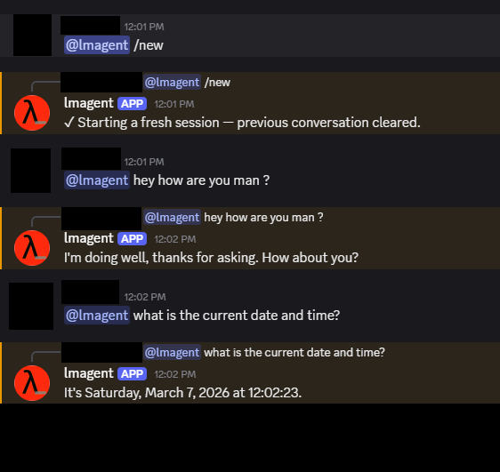

# LMAgent

<p align="center">
  
</p>

<p align="center">
  A locally-hosted AI agent that connects to any OpenAI-compatible LLM and autonomously completes real tasks.<br>
  Reads and writes files. Runs shell commands. Manages git. Coordinates complex multi-step work through a hierarchical sub-agent system.<br>
  <strong>Everything runs on your machine. No cloud. No subscriptions.</strong>
</p>

<p align="center">
  <a href="https://www.youtube.com/shorts/-_jKwfssAvA">
    
  </a>
</p>

<p align="center">
  <em>✦ UI updated — new demo coming soon ✦</em>
</p>

---


<p align="center">
  
</p>

LMAgent doesn't have to live in a browser tab. Once agent_web.py is running, you can wire up Discord, Telegram, WhatsApp, or SMS and talk to your agent from your phone, your server, or wherever you already spend time.
Each platform gets its own persistent session — your conversation survives restarts and picks up where you left off. Send /new on any platform to wipe the session and start fresh.
Discord — run it as a bot in your own server or via DMs. Mention it or message it directly and it responds in-thread.
Telegram — long-polling bot, works on mobile out of the box. Good option if you want to fire off tasks on the go.
WhatsApp — connects via the Green API. Same idea — message it like a contact, get a reply when the task is done.
SMS — Twilio webhook. If you want to send a task from a basic phone with no app, this is the option.
Only one platform is active at a time. You switch between them from the web UI's messaging panel, which also shows connection status and a live feed of recent messages.
Setup is just API keys in your .env and agent_messaging.py alongside the other files.

---

## Thank You

Started this for me. Somewhere along the way, it became something people actually gave a damn about.

66 stars is a number, but what it really represents is people choosing to spend attention on something I poured effort into. That means more than I can say.

Thank you, I don't say that as a formality.

---

1. Install dependencies
bashpip install requests flask colorama psutil docker
Requires Python 3.10 or later.
Optional extras — only install what you need:
bashpip install Pillow              # image uploads in the web UI
pip install discord.py          # Discord messaging integration
pip install python-telegram-bot # Telegram messaging integration
pip install twilio              # SMS integration
WhatsApp (Green API) and QR code sign-in require no extra packages.
If a messaging dep is missing, LMAgent will print the exact install command and disable that platform — it won't crash.

---

## What Is This?

You give LMAgent a task in plain English. It figures out the steps, uses real tools to execute them, checks its own work, and tells you when it's done.

**Good at:**
- Generating or refactoring code across multiple files
- Processing batches of files — renaming, converting, summarising
- Building web projects with HTML, CSS, and JavaScript
- Answering questions about your own codebase using grep and read
- Running shell commands and reacting to their output
- Any multi-step task that would take you several tool switches to do manually

**Not magic:** It will get stuck occasionally — especially on models smaller than 7B. The loop detector catches most infinite loops automatically, but it isn't perfect. Keep git handy as a rollback.

---

## Quick Start

### 1. Install dependencies
```bash
pip install requests flask colorama psutil docker
```
Requires Python 3.10 or later.

### 2. Start Docker Desktop
[Download here](https://www.docker.com/products/docker-desktop/). The sandbox container is created automatically on first use. On macOS/Linux, Docker is optional — a process-group fallback is used, but it does not isolate the filesystem.

### 3. Set up your LLM
LMAgent works with any OpenAI-compatible API. The easiest option is [LM Studio](https://lmstudio.ai/):
1. Download and install LM Studio
2. Load a model (7B+ instruct or coder models work best)
3. Start the local server — it runs at `http://localhost:1234` by default

### 4. Create a workspace
```bash
mkdir ~/lmagent_workspace
```
This is the only directory the agent can read and write. It cannot touch anything outside it.

### 5. Create a `.env` file
```env
WORKSPACE="/home/you/lmagent_workspace"
LLM_URL="http://localhost:1234/v1/chat/completions"
LLM_API_KEY="lm-studio"
LLM_MODEL=""
PERMISSION_MODE="normal"
```

### 6. Run it

**Terminal REPL:**
```bash
python agent_main.py
```

**Web UI:**
```bash
python agent_web.py
```
Open `http://localhost:7860` — a PIN is printed to the console on startup.

---

## How It Works — The 9 Files

LMAgent is nine files. Each one has a distinct job and they stack cleanly on top of each other.

---

### `agent_core.py` — The Engine Room
Pure infrastructure. No LLM prompting logic lives here — just the plumbing everything else depends on.

- **Config** — all settings from env vars / `.env` (model URL, token limits, workspace path, feature flags)
- **Safety** — validates file paths stay inside the workspace, blocks dangerous shell commands, prevents path traversal
- **ShellSession** — a persistent bash or PowerShell process for running commands
- **Session/State management** — JSON-based persistence for conversations, todos, plans, and agent state across runs
- **Message compaction** — when the conversation exceeds the token budget, old messages are summarised so the agent doesn't run out of context mid-task
- **Loop detection** — notices when the agent is spinning (repeated tools, no progress, empty replies) and raises a warning before it wastes your time
- **MCP integration** — manages connections to external tool servers via the Model Context Protocol (JSON-RPC)

---

### `agent_tools.py` — The Toolbox
Every concrete action the agent can take lives here. Each tool is a Python function that validates its inputs, executes safely, and returns structured JSON. The LLM never runs commands directly — it calls tools, and the tools run commands.

- **File tools** — `read`, `write`, `edit`, `glob`, `grep`, `ls`, `mkdir` — all sandboxed to the workspace with path safety checks
- **Shell tool** — runs commands inside the Docker sandbox with configurable timeout and memory limits
- **Git tools** — `git_status`, `git_diff`, `git_add`, `git_commit`, `git_branch` with ref-name validation so the agent can't inject arbitrary git refs
- **Todo & Plan tools** — bookkeeping helpers; `todo_complete` automatically tells the agent to stop when all work is done
- **Vision tool** — sends an image to a loaded VLM (LLaVA, Qwen-VL, Pixtral, etc.) with a prompt; auto-detects whether a vision-capable model is loaded and hides itself if not
- **Delegation tools** — `delegate` (one sub-agent, one deliverable), `decompose` (up to 8 sequential sub-tasks with dependency ordering), and a backward-compat `task` wrapper — all route through BCA
- **`TOOL_SCHEMAS` + `TOOL_HANDLERS`** — the master registry mapping every tool name to its JSON schema (sent to the LLM) and its Python handler function

---

### `agent_llm.py` — The LLM Interface
Handles all communication with the model and interprets what comes back.

- **`SYSTEM_PROMPT`** — the agent's personality and rules: the prime directive ("stop the instant the job is done"), tool usage guidelines, delegation examples, and `BLOCKED`/`WAIT` formats. Carefully reworded so models default to *stopping* rather than *doing more*
- **`LLMClient`** — sends messages to the LLM endpoint with retry logic, streaming support, automatic recovery if the server drops, and JSON auto-repair for truncated tool-call arguments
- **`detect_completion()`** — decides whether the agent is done by scanning for `TASK_COMPLETE`, short "done"-style replies, or question-asking patterns. Bug-fixed so short completions like "Done." or "All files written." no longer fall through and cause unnecessary extra loops
- **`_process_tool_calls()`** — the post-response dispatcher: checks permissions, calls `_execute_tool()` for each tool, handles MCP responses, detects todo-loop situations, and injects hard-stop messages when the agent is spinning
- **`run_plan_mode()`** — a separate lightweight loop just for generating a JSON execution plan, no file writes
- **`run_sub_agent()`** — a backward-compat isolated agent runner with a restricted tool allowlist; new code uses BCA instead

---

### `agent_bca.py` — The Sub-Agent Architecture
Implements the **Brief-Contract Architecture** — a system for spawning focused child agents without drowning them in context.

**The problem it solves:** naive sub-agent systems pass the parent's full conversation history to every child. On a model with an 8k context window, a sub-agent spawned at iteration 80 gets ~40k tokens of noise and immediately fails.

**The fix — four principles:**
1. **Structured Briefs** — each child gets a minimal `brief.json` (objective + deliverable spec + extracted relevant data). The child reads only this, never the parent's conversation history
2. **Result Contracts** — every child writes a structured `result.json` when done. The parent reads JSON — no fragile string parsing
3. **Depth-Scoped Recursion** — every agent carries a depth integer. At max depth, `delegate` and `decompose` are removed from the tool list entirely — the model literally cannot attempt further recursion
4. **Scope Isolation** — each agent gets a private scratch directory for temp work; deliverables always go to workspace-root-relative paths

**The three delegation tools:**
- `delegate` — spawn one focused sub-agent for one atomic objective with one clear deliverable
- `decompose` — split into up to 8 sequential sub-tasks with dependency ordering; each task's artifacts are automatically injected into dependent tasks' briefs
- `report_result` — how sub-agents signal completion (status, summary, artifact paths); the root agent uses `TASK_COMPLETE` instead

Also includes cycle detection, path enforcement that catches and redirects agents that accidentally write deliverables into their scratch directory, and an artifact verifier that recovers misplaced files after all sub-agents complete.

---

### `agent_main.py` — The Front Door
The entrypoint and orchestrator. Everything starts here.

- **CLI** — run a task directly, resume a session by ID, list recent sessions, or launch the background scheduler
- **Interactive REPL** — a chat loop with slash commands (`/help`, `/status`, `/plan`, `/todo`, `/sessions`, `/mode`, `/soul`, `/new`)
- **`run_agent()`** — the core loop: sends messages to the LLM, processes tool calls, detects completion, saves session state. Includes bug fixes for empty-reply loops and post-tool stalls where the agent keeps talking without finishing
- **Scheduler daemon** — polls an inbox directory for `.task` files and auto-resumes sleeping sessions at their scheduled wake time

---

### `agent_web.py` — The Flask Web Server
The optional browser interface — wraps the entire agent system in a web API.

- **Auth & Security** — PIN-based auth (printed to console on startup), rate limiting (120 req/min), optional HTTPS, security headers, QR code sign-in page for mobile
- **`/chat`** — receives a message, spawns the agent in a background thread, returns immediately; the browser gets all output via SSE
- **`/stream`** — Server-Sent Events endpoint; all agent output (tokens, tool calls, status, iteration counts) is broadcast here and replayed to new connections from a persistent chat log buffer
- **`/stop`** — kills a running agent mid-stream, cleanly
- **File routes** — `/filetree`, `/fileread`, `/workspace/mtime`, `/serve/<path>` (serves workspace files with asset URL rewriting so HTML previews render correctly in-browser)
- **BCA hooks** — monkey-patches `_run_bca_agent`, `tool_delegate`, and `tool_decompose` to broadcast sub-agent progress to the SSE stream so you can watch the full delegation hierarchy work in real time
- **Background scheduler** — runs the same session-wake scheduler from `agent_main.py` as a daemon thread, patched so it doesn't clobber the browser's active session
- **Messaging integration** — hooks into `agent_messaging.py` for Discord/Telegram/WhatsApp/SMS input sources

---

### `agent_web_ui.html` — The Browser UI
The entire frontend in one self-contained HTML file. Dark-themed chat interface, vanilla JS, no framework.

- **SSE client** — connects to `/stream`, auto-reconnects on drop, replays full chat history on reconnect
- **Live rendering** — tokens stream in and render as Markdown in real time; tool calls appear as collapsible groups showing name, args, and ✓/✗ result; thinking blocks from reasoning models (QwQ, DeepSeek-R1) are collapsed by default
- **File tree panel** — slide-in drawer with the full workspace directory tree, live file preview, auto-refreshes every 3s when open, and a `▶ preview` button for HTML files that opens them in a sandboxed iframe modal
- **Messaging panel** — shows live connection status for each platform, lets you switch the active input source, and shows a recent message feed
- **Command palette** — `/` triggers autocomplete for slash commands; arrow keys + Enter to select
- **Image upload** — drag-and-drop, paste, or file picker; images upload to the workspace and the path gets appended to the next message for the vision tool
- **Whisper** — while the agent is running, typing in the input box sends a mid-run nudge rather than queuing a new task

---

### `agent_messaging.py` — External Messaging Integrations
Plugs Discord, Telegram, WhatsApp, and SMS into the agent as alternative input sources. Only one platform can be "active" at a time — switchable from the web UI.

- **Discord** — `discord.py` bot, responds to DMs and @mentions
- **Telegram** — `python-telegram-bot` with long polling
- **WhatsApp** — polls the Green API in a background loop
- **SMS** — registers a Flask webhook at `/sms` that Twilio hits on inbound texts

All four funnel into the same `_run_messaging_task()` function, which acquires the agent lock, runs the agent, collects the streamed output, and sends the reply back.

**Persistent sessions:** every platform user gets their own `platform:sender → session_id` mapping saved to `.lmagent/messaging_sessions.json`. Conversations survive server restarts. Send `/new` on any platform to wipe your session and start fresh.

---

### `sandboxed_shell.py` — The Execution Sandbox
The safety layer that runs every shell command the agent issues. Two backends depending on your platform:

**Docker backend** (Windows by default, or `FORCE_DOCKER=True` on any OS): Creates one persistent hardened container named `claude-sandbox` and reuses it for every call — no spin-up overhead after the first run. The container runs with all Linux capabilities dropped, a read-only root filesystem, a `/tmp` tmpfs, and CPU/memory/PID limits. On process exit it's stopped but not deleted, so the next run reconnects to it instantly by name.

**Process-group backend** (macOS/Linux default): Spawns a subprocess in a new process group, applies `rlimit` memory and CPU caps, then kills the entire process group on timeout or completion. `psutil` sweeps any orphaned child processes.

If Docker was requested but isn't running, it falls back to the process-group backend and prints a loud `INSECURE FALLBACK` warning banner to the terminal so you know filesystem isolation is gone.

Public API: `run_sandboxed(cmd, workspace, timeout, ...) → (output, exit_code)`

---

## Available Tools

| Category | Tools |
|---|---|
| Files | `read`, `write`, `edit`, `glob`, `grep`, `ls`, `mkdir` |
| Shell | `shell` — sandboxed, up to 120s timeout, up to 2GB memory |
| Git | `git_status`, `git_diff`, `git_add`, `git_commit`, `git_branch` |
| Todos | `todo_add`, `todo_complete`, `todo_update`, `todo_list` |
| Planning | `plan_complete_step`, `task_state_update`, `task_state_get`, `task_reconcile` |
| Sub-agents | `delegate`, `decompose`, `report_result` |
| Vision | `vision` — only shown when a VLM is detected |
| Utilities | `get_time` |

---

## Configuration

| Variable | Default | Description |
|---|---|---|
| `WORKSPACE` | `~/lm_workspace` | The only directory the agent can touch |
| `LLM_URL` | `http://localhost:1234/v1/chat/completions` | LLM API endpoint |
| `LLM_API_KEY` | `lm-studio` | API key (anything works for local servers) |
| `LLM_MODEL` | *(blank)* | Model name; blank = server default |
| `PERMISSION_MODE` | `normal` | `auto` / `normal` / `manual` |
| `LLM_TEMPERATURE` | `0.65` | Sampling temperature |
| `LLM_TIMEOUT` | `560` | Seconds to wait for a response |
| `MAX_ITERATIONS` | `500` | Hard cap per task |
| `THINKING_MODEL` | `true` | Strip `<think>` blocks (for QwQ, DeepSeek-R1) |
| `ENABLE_SUB_AGENTS` | `true` | Allow sub-agent spawning |
| `VISION_ENABLED` | `auto` | `auto` probes LM Studio; `true`/`false` forces it |
| `AGENT_MAX_DEPTH` | `3` | Maximum sub-agent nesting depth |

---

## Usage

```bash
# Interactive REPL
python agent_main.py

# One-shot task
python agent_main.py "Summarise all Python files in this workspace"

# Web UI
python agent_web.py

# Resume a session
python agent_main.py --list-sessions
python agent_main.py --resume SESSION_ID

# Plan before acting
python agent_main.py --plan "refactor the authentication module"

# Background scheduler
python agent_main.py --scheduler
python agent_main.py --submit "generate the weekly report"
```

---

## Slash Commands

| Command | Description |
|---|---|
| `/help` | Show all commands |
| `/sessions` | List recent sessions |
| `/mode <level>` | Change permission mode (`auto` / `normal` / `manual`) |
| `/plan` | Show the current execution plan |
| `/todo` | Show the current todo list |
| `/status` | Agent, LLM, sandbox, and MCP status |
| `/soul` | Show the loaded personality config |
| `/new` | Start a completely fresh session |
| `/session` | Show the current session ID |

---

## Personality & Project Context

**`.lmagent/.soul.md`** — give the agent a persistent personality:
```markdown
You are a meticulous backend engineer who prefers functional patterns.
Always add type hints. Write tests before implementation.
When uncertain, ask rather than assume.
```

**`.lmagent.md`** — inject persistent project context into every session:
```markdown
Stack: Python 3.12, FastAPI, PostgreSQL
Tests: pytest, always run before committing
Style: Black formatter, max line 100
```

---

## MCP Servers

Create `.lmagent/mcp.json` in your workspace to connect external tool servers (web search, databases, browser control, etc.):

```json
{
  "mcpServers": {
    "brave-search": {
      "command": "npx",
      "args": ["-y", "@modelcontextprotocol/server-brave-search"],
      "env": { "BRAVE_API_KEY": "your-key-here" }
    }
  }
}
```

---

## Security

All shell and git commands run inside a Docker container that:
- Can only read and write your workspace directory
- Has a read-only root filesystem
- Drops all Linux capabilities
- Caps at 512 MB RAM and 90% of one CPU core by default
- Blocks path traversal, environment variable paths, and navigation commands

If Docker is not running, a warning is printed and a fallback sandbox is used — but it does not provide filesystem isolation.

---

## Tips

**Model choice matters.** Larger instruct models (13B+) follow tool-use patterns more reliably. Avoid pure chat models — instruct or coder variants perform significantly better.

**Thinking models (QwQ, DeepSeek-R1):** Set `THINKING_MODEL=true` (default). Reasoning tokens are stripped before being fed back into context so they don't crowd out actual task state.

**Keep the workspace in git.** The agent makes real changes. If something goes wrong, git is your rollback.

**Sub-agents for complex tasks:** `delegate` works best with one clear output. `decompose` is better when steps depend on each other (CSS → HTML that imports it → JS that references both). Pass specific values like colors, URLs, and API responses via `data_hint` rather than expecting sub-agents to infer them.

**Large batch jobs:** Use `task_state_update` after each file. This checkpoints progress so it survives context compaction and restarts.

**Vision not appearing?** Set `VISION_ENABLED=true` in `.env` to bypass the LM Studio probe.

**Debugging sub-agents:** Remove the `cleanup_session_dirs(workspace)` call at the end of `run_agent()` in `agent_main.py`. The `brief.json` and `result.json` files will persist after each run so you can inspect exactly what each agent was told and what it returned.

---

## Limitations

- The POSIX fallback does not isolate the filesystem. Only Docker provides full isolation.
- The web UI is single-user. A second request while one is running returns HTTP 429.
- The vision probe is LM Studio-specific. Other backends need `VISION_ENABLED=true`.
- The scheduler uses polling — minimum wakeup granularity is `SCHEDULER_POLL_INTERVAL` seconds (default 60).
- Sub-agent nesting is capped at depth 3, configurable via `AGENT_MAX_DEPTH`.

---

## File Reference

| File | Role |
|---|---|
| `agent_core.py` | Config, safety, sessions, compaction, loop detection, MCP |
| `agent_tools.py` | Tool handlers, schemas, tool registry, vision |
| `agent_llm.py` | LLM client, streaming, execution loop, system prompts |
| `agent_bca.py` | Brief-Contract Architecture — sub-agent orchestration |
| `agent_main.py` | CLI entrypoint, interactive REPL, background scheduler |
| `agent_web.py` | Flask web UI — auth, SSE, file browser, BCA hooks |
| `agent_web_ui.html` | Browser frontend — chat, file tree, command palette, image upload |
| `agent_messaging.py` | Discord / Telegram / WhatsApp / SMS integrations |
| `sandboxed_shell.py` | Cross-platform sandboxed subprocess execution |

All nine files must be in the same directory.
