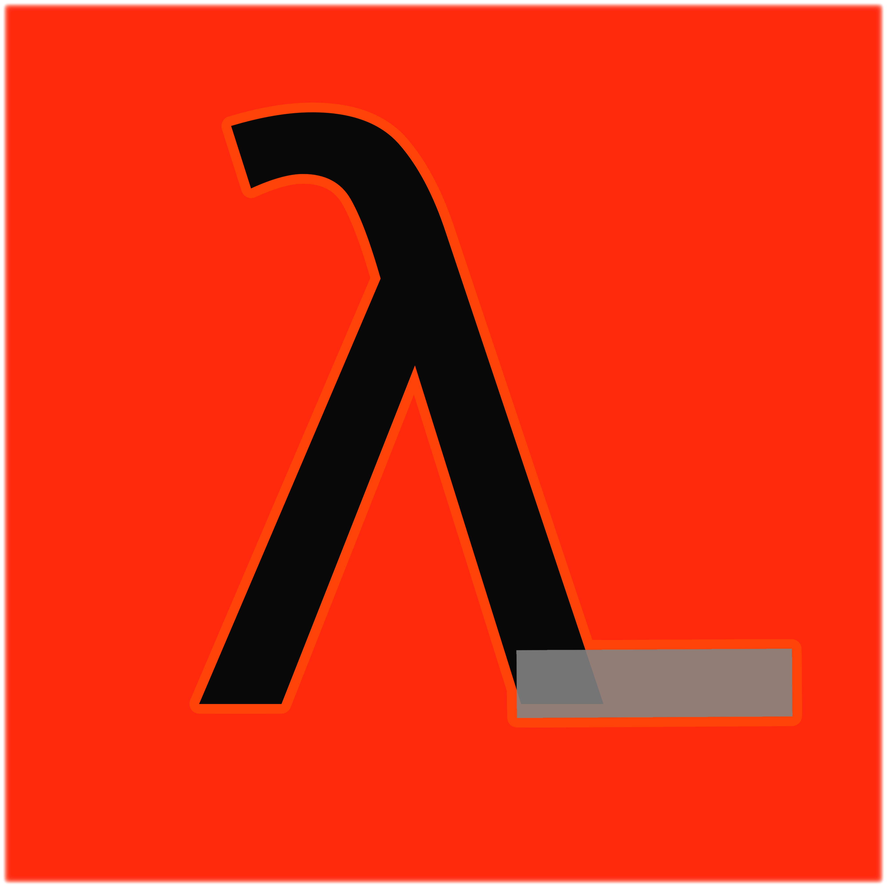

# LMAgent

<p align="center">
  
</p>

A locally-hosted AI agent that connects to any OpenAI-compatible LLM — LM Studio, Ollama, or a remote API — and autonomously completes real tasks: reading and writing files, running shell commands, managing git, tracking todos, and coordinating complex multi-step work through a hierarchical sub-agent system. Everything runs on your machine. No cloud. No subscriptions.


---

## Thank You

56 stars on something I built for myself. I don't have a better way to say it than that means a lot. If you've tried it, broken it, or just poked around, thank you for spending time on it. Your feedback only helps me do better.

---

## What It Actually Does

LMAgent is a terminal-first agentic loop. You give it a task in plain English. It breaks the task down, uses tools to execute it, checks its own work, and tells you when it's done.

It works best on tasks like:
- Generating or refactoring code across multiple files
- Processing batches of files (renaming, converting, summarising)
- Building web projects with HTML, CSS, and JavaScript
- Answering questions about your own codebase using grep and read
- Running shell commands and reacting to their output
- Any multi-step task that would take you several tool switches to do manually

It won't replace careful human judgment on ambiguous or high-stakes decisions. It will get stuck occasionally — especially on models smaller than 7B — and you'll need to nudge it or restart. The loop detector catches most infinite loops automatically, but it isn't perfect.

---

## How It Works

LMAgent is made of five files that work together:

**`agent_core.py`** is the foundation. It handles configuration, session storage, todo and plan tracking, message compaction, loop detection, shell sessions, and the safety layer that restricts what the agent can touch. Nothing runs without this.

**`agent_tools.py`** defines every tool the agent can call: reading and writing files, running shell commands inside a Docker sandbox, git operations, todo management, and more. Each tool is a Python function that validates its inputs, executes safely, and returns structured JSON. The LLM never runs commands directly — it calls tools, and the tools run commands.

**`agent_llm.py`** is the execution loop. It sends messages to your LLM, parses tool calls from the response, dispatches them through the tool layer, appends the results, and loops until the task is done or a stopping condition is met. It also handles streaming output and permission prompts.

**`agent_bca.py`** implements the Brief-Contract Architecture — the sub-agent system. When a task is genuinely complex, the root agent can spawn child agents. Each child gets a compact brief (not the parent's full conversation history), does its work, and writes a structured result back to disk. This keeps each agent's context small and focused, which matters a lot on local models with limited context windows.

**`agent_main.py`** is the entrypoint. It wires everything together, runs the interactive REPL, and manages a background scheduler for timed or deferred tasks.

**`agent_web.py`** is an optional Flask web UI. It exposes the same agent over a browser interface with live streaming, a file tree, session history, and image upload for vision tasks.

**`sandboxed_shell.py`** handles subprocess isolation. All shell commands run inside a persistent Docker container that can only see your workspace directory. If Docker isn't running, it falls back to a process-group sandbox with resource limits, though without filesystem isolation.

---

## Quick Start

### 1. Install dependencies

```bash
pip install requests flask colorama psutil docker
```

Requires Python 3.10 or later.

### 2. Install and start Docker Desktop

[Download here](https://www.docker.com/products/docker-desktop/). The sandbox container is created automatically on first use. On macOS/Linux, Docker is optional — a fallback sandbox is used, but it does not isolate the filesystem.

### 3. Set up your LLM

LMAgent works with any OpenAI-compatible API. The easiest option is [LM Studio](https://lmstudio.ai/):

1. Download and install LM Studio
2. Load a model (7B+ instruct or coder models work best)
3. Start the local server — it runs at `http://localhost:1234` by default

Ollama and remote APIs also work. Update `LLM_URL` in your config accordingly.

### 4. Create a workspace

This is the directory the agent can read and write. It cannot touch anything outside it.

```bash
mkdir ~/lmagent_workspace
```

### 5. Create a `.env` file

Place this next to the agent scripts:

```env
WORKSPACE="/home/you/lmagent_workspace"
LLM_URL="http://localhost:1234/v1/chat/completions"
LLM_API_KEY="lm-studio"
LLM_MODEL=""
PERMISSION_MODE="normal"
```

If you skip this step, LMAgent will prompt you on first launch and offer to save your choices.

### 6. Run it

**Terminal REPL:**
```bash
python agent_main.py
```

**Web UI:**
```bash
python agent_web.py
```
Then open `http://localhost:7860`. A PIN is printed to the console on startup.

---

## Security

All shell and git commands run inside a Docker container. The container:

- Can only read and write your workspace directory
- Has a read-only root filesystem
- Drops all Linux capabilities
- Is capped at 512 MB RAM and 90% of one CPU core by default
- Blocks path traversal, environment variable paths, and navigation commands

The agent cannot access files outside your workspace, run privileged operations, or escape the container. If Docker is not running, a warning is printed and a fallback sandbox is used — but the fallback does not provide filesystem isolation.

---

## Usage

### Interactive REPL

```bash
python agent_main.py
```

Type a task and press Enter. The agent streams its output as it works. Use `/help` to see available slash commands.

### One-shot task

```bash
python agent_main.py "Summarise all Python files in this workspace"
```

Exits with a meaningful code: `0` for success, `2` for max iterations, `130` for Ctrl+C, `1` for error.

### Web UI

```bash
python agent_web.py
```

Supports live streaming, a collapsible file tree, session history, drag-and-drop image upload for vision tasks, and a stop button. Accessible from any device on your local network.

### Resume a session

```bash
python agent_main.py --list-sessions
python agent_main.py --resume SESSION_ID
```

Sessions are stored in `<workspace>/.lmagent/sessions/` and persist across restarts.

### Plan before acting

```bash
python agent_main.py --plan "refactor the authentication module"
```

The agent produces a step-by-step plan for your approval before doing anything.

### Scheduler daemon

```bash
python agent_main.py --scheduler
```

Runs a background scheduler that picks up tasks from an inbox directory and auto-resumes sessions that were set to wake at a future time. Useful when running alongside the web UI.

```bash
python agent_main.py --submit "generate the weekly report"
```

Drops a task into the scheduler's inbox.

---

## Available Tools

### Files
`read`, `write`, `edit` (fuzzy search-and-replace), `glob`, `grep`, `ls`, `mkdir`

### Shell
`shell` — runs inside the Docker sandbox, timeout up to 120s, memory up to 2GB

### Git
`git_status`, `git_diff`, `git_add`, `git_commit`, `git_branch` — all run inside the sandbox

### Task management
`todo_add`, `todo_complete`, `todo_update`, `todo_list`, `plan_complete_step`, `task_state_update`, `task_state_get`, `task_reconcile`

### Sub-agents
`delegate` — spawn a focused sub-agent for a single objective  
`decompose` — split a task into sequential sub-tasks with dependency ordering  
`report_result` — used by sub-agents to signal completion (never used by the root agent)

### Vision
`vision` — analyse an image file using a loaded vision model. Only appears when a VLM is detected. Accepts JPEG, PNG, GIF, and WebP.

### Utilities
`get_time`

---

## Sub-Agent System (BCA)

For complex tasks, the agent can spawn sub-agents via the Brief-Contract Architecture. The core idea is simple: instead of dumping the parent's conversation history into a child agent's context (which breaks on models with small context windows), each child gets a compact brief containing only what it needs. It does its work, writes a structured result to disk, and the parent reads that result as JSON.

**`delegate`** is for a single focused objective with one clear deliverable:

```
delegate(
  objective="Create index.html with a neon-themed landing page",
  deliverable_type="file",
  deliverable_path="index.html",
  deliverable_description="Single-page HTML with inline CSS, neon glow effects",
  data_hint="Colors: #0ff on #0a0a0a background"
)
```

**`decompose`** is for sequential tasks where later steps depend on earlier ones:

```json
{
  "tasks": [
    { "task_id": "t1", "objective": "Create styles.css", "depends_on": [] },
    { "task_id": "t2", "objective": "Create index.html importing styles.css", "depends_on": ["t1"] }
  ]
}
```

Sub-agents can themselves spawn sub-agents up to a depth of 3 (configurable). At max depth, `delegate` and `decompose` are removed from the tool list entirely — the model cannot attempt further recursion.

---

## Configuration

Set any of these in `.env` or as environment variables.

| Variable | Default | Description |
|---|---|---|
| `WORKSPACE` | `~/lm_workspace` | Directory the agent reads/writes |
| `LLM_URL` | `http://localhost:1234/v1/chat/completions` | LLM API endpoint |
| `LLM_API_KEY` | `lm-studio` | API key (anything works for local servers) |
| `LLM_MODEL` | *(blank)* | Model name; blank = server default |
| `PERMISSION_MODE` | `normal` | `auto` / `normal` / `manual` |
| `LLM_TEMPERATURE` | `0.65` | Sampling temperature |
| `LLM_TIMEOUT` | `560` | Seconds to wait for LLM response |
| `MAX_ITERATIONS` | `500` | Hard cap per task |
| `THINKING_MODEL` | `true` | Strip `<think>` blocks (for QwQ, DeepSeek-R1) |
| `ENABLE_SUB_AGENTS` | `true` | Allow sub-agent spawning |
| `SHELL_WORKSPACE_ONLY` | `true` | Block shell commands referencing outside paths |
| `VISION_ENABLED` | `auto` | `auto` probes LM Studio; `true` always enables; `false` always disables |
| `SUMMARIZATION_THRESHOLD` | `80000` | Token count that triggers context compaction |
| `AGENT_MAX_DEPTH` | `3` | Maximum sub-agent nesting depth |

---

## Slash Commands (REPL)

| Command | Description |
|---|---|
| `/help` | Show all commands |
| `/sessions` | List recent sessions |
| `/mode <level>` | Change permission mode (`auto` / `normal` / `manual`) |
| `/plan` | Show the current execution plan |
| `/todo` | Show the current todo list |
| `/status` | Show agent, LLM, shell sandbox, and MCP status |
| `/soul` | Show the loaded personality config |
| `/new` | Start a completely fresh session |
| `/session` | Show the current session ID |
| `quit` | Exit |

---

## Personality

Create `.lmagent/.soul.md` in your workspace to give the agent a persistent personality or standing instructions:

```markdown
You are a meticulous backend engineer who prefers functional patterns.
Always add type hints. Write tests before implementation.
When uncertain, ask rather than assume.
```

## Project Context

Create `.lmagent.md` in your workspace to inject persistent project context into every session:

```markdown
Stack: Python 3.12, FastAPI, PostgreSQL
Tests: pytest, always run before committing
Style: Black formatter, max line 100
Source: src/
```

---

## MCP Servers

LMAgent supports the [Model Context Protocol](https://modelcontextprotocol.io/) for connecting external tool servers (web search, databases, browser control, etc.).

Create `.lmagent/mcp.json` in your workspace:

```json
{
  "mcpServers": {
    "brave-search": {
      "command": "npx",
      "args": ["-y", "@modelcontextprotocol/server-brave-search"],
      "env": { "BRAVE_API_KEY": "your-key-here" }
    }
  }
}
```

Restart LMAgent and MCP tools will appear automatically alongside built-in tools.

---

## Tips

**Model choice matters.** Larger instruct models (13B+) follow tool-use patterns more reliably. Smaller models work but may need more nudging. Avoid pure chat models — instruct or coder variants perform significantly better.

**Thinking models (QwQ, DeepSeek-R1):** Set `THINKING_MODEL=true` (default). Reasoning tokens are stripped from the context window before being fed back, which prevents reasoning noise from crowding out actual task state.

**Keep the workspace in git.** The agent makes real changes. If something goes wrong, git is your rollback.

**Sub-agents for complex tasks:** `delegate` works best when there's one clear output. `decompose` is better when you have a sequence where each step depends on the last (e.g. CSS → HTML that imports it → JS that references both). Pass specific values like colors, URLs, and API responses via `data_hint` rather than expecting sub-agents to infer them.

**Large batch jobs:** For tasks processing hundreds of files, use `task_state_update` after each file. This checkpoints progress explicitly so it survives context compaction and restarts.

**Docker not running?** You'll see a warning. The fallback sandbox limits CPU and memory but doesn't isolate the filesystem. Start Docker Desktop for full isolation.

**Vision not appearing?** If your model has vision capability but the tool isn't showing up, set `VISION_ENABLED=true` in `.env` to bypass the LM Studio probe.

**Debugging sub-agents:** Remove the `cleanup_session_dirs(workspace)` call at the end of `run_agent()` in `agent_main.py`. The `brief.json` and `result.json` files will persist after each run so you can inspect exactly what each agent was told and what it returned.

---

## Limitations

- **The POSIX fallback does not isolate the filesystem.** Only Docker provides full isolation. On macOS/Linux without Docker enabled, the agent can reach outside the workspace through the shell tool.
- **The web UI is single-user.** A second request while one is running returns HTTP 429.
- **The vision probe is LM Studio-specific.** Other backends don't expose the same models endpoint — set `VISION_ENABLED=true` to skip it.
- **The scheduler uses polling.** Minimum wakeup granularity is `SCHEDULER_POLL_INTERVAL` seconds (default 60).
- **Sub-agent nesting is capped at depth 3.** Configurable via `AGENT_MAX_DEPTH`.

---

## Files

| File | Role |
|---|---|
| `agent_core.py` | Config, logging, sessions, safety, shell, compaction |
| `agent_tools.py` | Tool handlers, schemas, tool registry, vision |
| `agent_llm.py` | LLM client, streaming, execution loop, system prompts |
| `agent_bca.py` | Brief-Contract Architecture — sub-agent orchestration |
| `agent_main.py` | CLI entrypoint, REPL, background scheduler |
| `agent_web.py` | Flask web UI |
| `sandboxed_shell.py` | Cross-platform sandboxed subprocess execution |

All seven files must be in the same directory.
